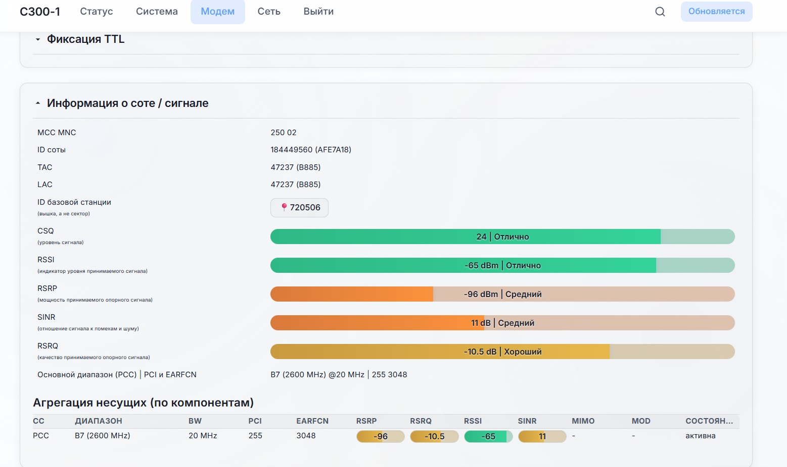
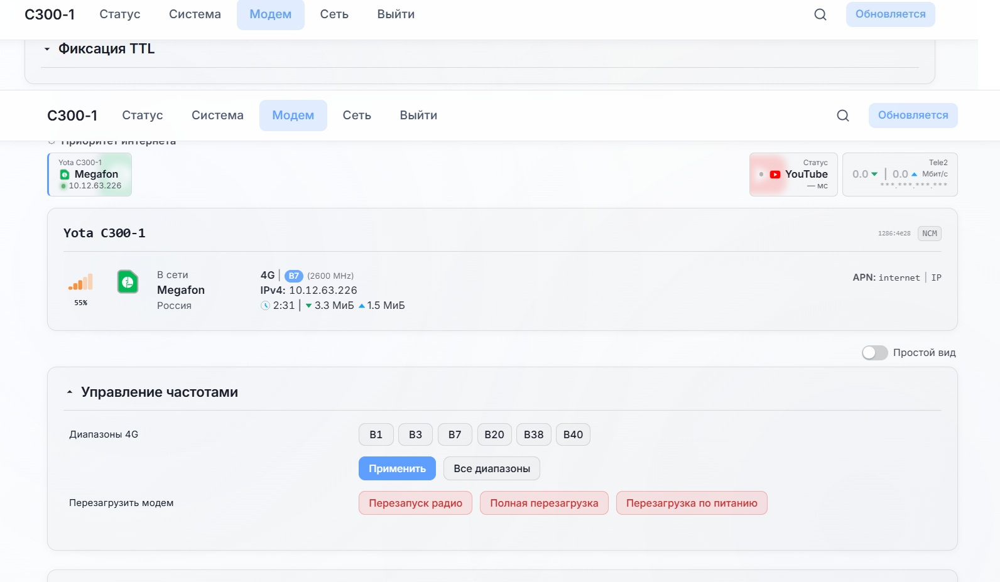
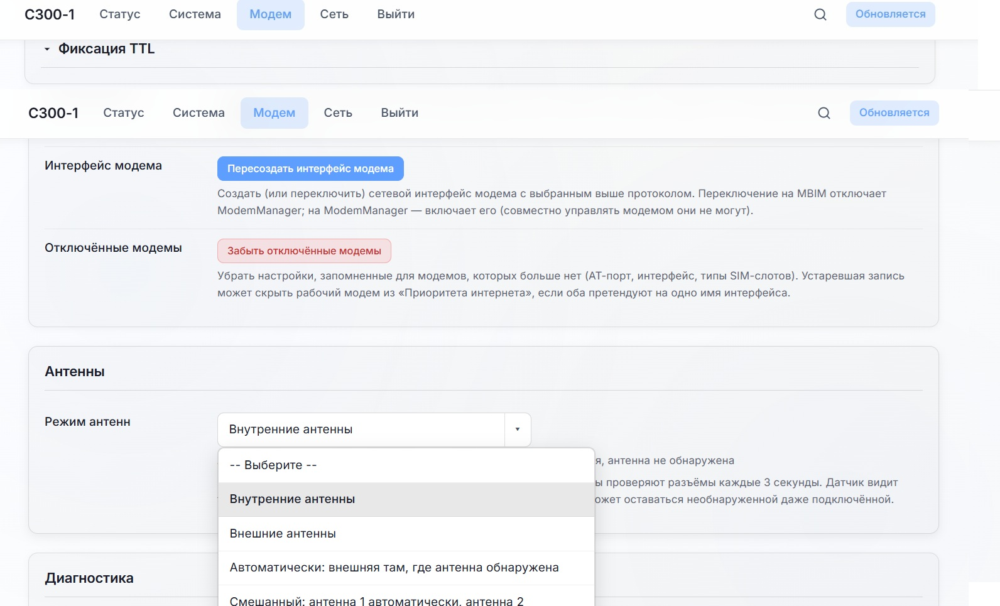
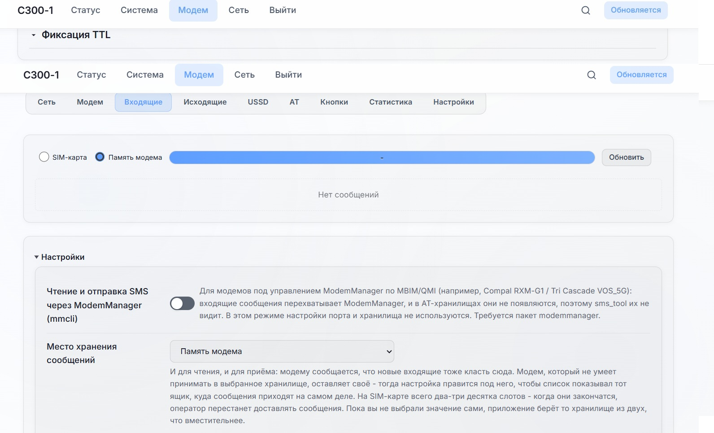

# OpenWrt для роутера YOTA/Megafon C300-1 (Notion R281)

Кастомная сборка OpenWrt для роутера **Megafon/YOTA C300-1** (аппаратная платформа Notion R281, ramips/mt7621).

Поддерживаемые версии:
- **24.10.8** — с `3ginfo-lite` (старый интерфейс LTE)
- **25.12.5** — с `luci-app-5gmodem-lite`

> Сборка основана на [Build-R2x1](https://github.com/0x4C334E3438/Build-R2x1) для устройства от LENAR.
> Логика сборки приведена в соответствие с официальным vermagic ядра OpenWrt.

> ⚠️ **Помните: вы всё делаете на свой страх и риск, вам никто ничего не должен.**

## Workflow Used
- [actions/checkout](https://github.com/actions/checkout)
- [actions/upload-artifact](https://github.com/actions/upload-artifact)
- [softprops/action-gh-release](https://github.com/softprops/action-gh-release)

## Sources
- [openwrt/openwrt](https://github.com/openwrt/openwrt)
- [ChesterGoodiny/luci-theme-proton2025](https://github.com/ChesterGoodiny/luci-theme-proton2025)
- [fildunsky/luci-app-5gmodem](https://github.com/fildunsky/luci-app-5gmodem) — фид `src-git 5gmodem`
- [OpenWrt Downloads](https://downloads.openwrt.org) — официальный `config.buildinfo` и distfeeds

## О инициализации LTE-модуля

Штатному LTE-модулю для работы требуется код инициализации. Известны два способа заставить его работать в OpenWrt:

1. **Получение кода инициализации из заводской прошивки** и внесение его в скрипт инициализации OpenWrt — описано ниже.
2. **Перепрошивка LTE-модуля** модифицированной прошивкой от LENAR с вырезанной процедурой инициализации — [способ описан здесь](https://4pda.to/forum/index.php?showtopic=1044372&view=findpost&p=143896115).

> ⚠️ **Важно:** перед прошивкой версии от Megafon в OpenWrt (если есть необходимость использования в сетях других операторов) обязательно выполните **постоянную** разблокировку LTE-модуля. Временная разблокировка теряется при перепрошивке!

## Установка

### 1. Подготовка

Подключите роутер к интернету (WAN-кабель или SIM-карта), зайдите в веб-интерфейс стандартной прошивки и проверьте наличие обновлений — обновитесь, если доступно (для актуальной версии прошивки LTE-модуля).

### 2. Получение доступа к заводской прошивке по SSH и разблокировка

Ниже — сжатая инструкция по разблокировке заводской прошивки C300-1 (полная версия — [`С300-1final.pdf`](assets/c300-1final.pdf) в репозитории).

<details>
<summary>2.1. Получение доступа через Telnet/SSH (метод webspy)</summary>

(Если данный метод получения Telnet/SSH не работает, ищите актуальный способ : [на 4PDA](https://4pda.to/forum/index.php?showtopic=1044372)

1. Установите расширение для Chrome **webspy**. Из-за блокировки Chrome используйте [Chromium Gost](https://www.cryptopro.ru/products/chromium-gost): откройте `chrome://extensions/`, включите «Режим разработчика», перетащите файл [`.crx`](https://disk.yandex.ru/d/cEUTJnBNAu3A3Q) в окно и подтвердите установку.
2. Установите **PuTTY** и **WinSCP**.
3. После установки webspy доступен по `Ctrl+Shift+I` → `>>` → **SPY**.
4. Зайдите в веб-морду роутера, откройте webspy, перейдите на вкладку «Интернет» в веб-морде — в webspy появится список запросов.
5. Выберите верхний `xml_action.cgi`, прокрутите до раздела **Request Body**, замените его текст на:
   ```xml
   <?xml version="1.0" encoding="US-ASCII"?>
   <RGW>
   <param>
   <method>call</method>
   <session>000</session>
   <obj_path>wireless</obj_path>
   <obj_method>wifi_ate_enable</obj_method>
   </param>
   </RGW>
   ```
6. Нажмите **SEND**, в Answer Body должен быть ответ `ОК`.
7. Закройте webspy и перезагрузите роутер через веб-морду.
8. После перезагрузки откройте PuTTY, укажите адрес роутера, тип соединения **Telnet**, нажмите Open.
9. Выполните:
   ```
   ubus call router set_dropbear_info '{"dropbear_mode":"1","dropbear_key_type":"99"}'
   ```
   Ответ — `OK`.
10. Выполните `passwd` и задайте пароль для root (например, `root`) — ввод не отображается на экране, это нормально.
11. Выполните:
    ```
    fw_setenv dropbear_password root
    ubus call wireless wifi_ate_disabled
    ```
    Окно PuTTY закроется само.
12. Заново откройте PuTTY, но уже в режиме **SSH**, авторизуйтесь `root`/`root`.

Готово — доступ к OpenWrt через SSH получен.

</details>

<details>
<summary>2.2. Разблокировка LTE-модуля (удаление/замена IMEI)</summary>
   
(На роутере С300-1 YOTA это не обязательная процедура, так как он не требует MEP код при смене оператора.)
   
Самый простой способ «разблокировать» модуль — удалить IMEI (работает без него; проверено минимум 6 месяцев непрерывной работы):

```
ubus call version set_atcmd_info '{"atcmd":"AT*PROD=2"}'
ubus call version set_atcmd_info '{"atcmd":"AT*MRD_IMEI=D"}'
ubus call version set_atcmd_info '{"atcmd":"AT*PROD=0"}'
reboot
```

На все три команды ответ должен быть `OK`.

> **Для Казахстана и роутеров Алтел P28**: если вместо OK видите `NOT FOUND`, команду `AT*MRD_IMEI=U,0101,12NOV2010,XXXXXXXXXXXXXXX` замените на `AT*MRD_IMEI=W,0101,01NOV2012,XXXXXXXXXXXXXXX`. Ввод MEP-кода может быть недоступен в веб-интерфейсе — потребуется альтернативная версия интерфейса.

**Восстановление старого IMEI** (XXXXXXXXXXXXXXX — ваш IMEI с наклейки):
```
ubus call version set_atcmd_info '{"atcmd":"AT*PROD=2"}'
ubus call version set_atcmd_info '{"atcmd":"AT*MRD_IMEI=U,0101,12NOV2010,XXXXXXXXXXXXXXX"}'
ubus call version set_atcmd_info '{"atcmd":"AT*PROD=0"}'
reboot
```

**Смена IMEI на смартфонный (для операторов, отличных от Yota/Megafon)** — для C300-1 Megafon требуется MEP-код. Используется временная переходная пара IMEI/MEP:

1. Пропишите временный IMEI:
   ```
   ubus call version set_atcmd_info '{"atcmd":"AT*PROD=2"}'
   ubus call version set_atcmd_info '{"atcmd":"AT*MRD_IMEI=U,0101,12NOV2010,866626053925843"}'
   ubus call version set_atcmd_info '{"atcmd":"AT*PROD=0"}'
   reboot
   ```
2. После перезагрузки в веб-интерфейсе: **Интернет → Настройки MEP**, введите код разблокировки `33652303`.
3. Сразу после подтверждения, не закрывая окно, в SSH/PuTTY пропишите свой заранее сгенерированный постоянный IMEI:
   ```
   ubus call version set_atcmd_info '{"atcmd":"AT*PROD=2"}'
   ubus call version set_atcmd_info '{"atcmd":"AT*MRD_IMEI=U,0101,12NOV2010,XXXXXXXXXXXXXXX"}'
   ubus call version set_atcmd_info '{"atcmd":"AT*PROD=0"}'
   ```
4. Перезагрузите роутер через веб-интерфейс — MEP-код больше не потребуется.

</details>

### 3. Резервное копирование заводской прошивки

Через SSH/WinSCP (протокол SCP, `root`/`root`) сохраните образ прошивки на всякий случай:

```
cat /dev/mtd4 > /tmp/mtd4.bin
```

Перенесите `mtd4.bin` из `/tmp` на компьютер (память роутера ограничена) — этим файлом можно будет восстановить заводскую прошивку, в том числе через death mode (см. ниже).

### 4. Определение кода инициализации LTE-модуля

Через PuTTY выполните:
```
ubus call version set_atcmd_info '{"atcmd":"at+reset"}'|cat /dev/log_radio|grep "CHECKATVALID"
```
Модуль перезагрузится и выведет код вида `AT+CHECKATVALID=1234567890123456` — сохраните его, понадобится на шаге 8.

### 5. Проверка параметра загрузки

```
fw_printenv bootargs
```
Если `mtdblock5` — ничего не делайте. Если `mtdblock6`:
```
fw_setenv bootargs "console=ttyS1,57600n8 root=/dev/mtdblock5"
```

### 6. Прошивка factory-образа (death mode)

Скачайте из [Яндекс.Диска](https://disk.yandex.ru/d/ulunK1PtIoffZQ) файл `openwrt-ramips-mt7621-notion_r281-squashfs-factory.bin`, переименуйте в `firmware.bin`.

**Прошивка через death mode (tftpd32/64):**

1. Настройте сетевой адаптер компьютера на статический IP:
   - IP-адрес: `10.10.10.3`
   - Маска подсети: `255.255.255.0`
   - Основной шлюз: `10.10.10.123`
2. Положите `firmware.bin` в папку программы tftpd32/64.
3. Выключите питание роутера, подключите патч-корд во 2-й или 3-й LAN-порт.
4. Запустите tftpd32/64, убедитесь, что она слушает через ваш Ethernet-адаптер по IP `10.10.10.3`.
5. Зажмите скрытую кнопку reset на роутере и включите питание, удерживая reset до появления окна прошивки и старта прогресс-бара в tftpd.
6. После прошивки — долгий старт устройства, рекомендуется перезапустить по питанию ещё раз.

Этот же метод (death mode + tftpd32/64) используется и для восстановления из `mtd4.bin`, если роутер превратился в «кирпич».

### 7. Прошивка sysupgrade-образа

Через веб-интерфейс (`192.168.1.1`, логин `root`, пароль `notion`) прошейте `openwrt-ramips-mt7621-notion_r281-squashfs-sysupgrade.bin`.

Wi-Fi SSID и пароль генерируются скриптом:
- `Notion-0dra31-5G` / `Notion-0dra31`
- Пароль: `OP0dra31`

*(цифры у вас будут свои; пароль рекомендуется сменить)*

**Альтернативно, прошивка через SSH/WinSCP** (если предпочитаете консоль):
1. Скопируйте `.bin`-файл прошивки через WinSCP (протокол SCP, `root`/`root`) в `/tmp`.
2. Выполните:
   ```
   mtd -r write /tmp/xxxxxxxxxx.bin /dev/mtd4
   ```
   где `xxxxxxxxxx.bin` — имя файла прошивки.
3. После прошивки — долгий старт, рекомендуется перезапустить по питанию.

### 8. Привязка LTE-модуля

Подключитесь через WinSCP (логин `root`, пароль `notion`) и отредактируйте `/etc/gcom/ncm.json`. Найдите по слову `notion` секцию инициализации и вставьте свой код (полученный на шаге 4):

```json
"notion": {
    "initialize": [
        "AT*APPOWERIND=0",
        "AT+CHECKATVALID=1234567890123456",
        "AT+CFUN=1",
        "AT+CMGF=1",
        "AT+CNMI=2,1,0,0,0"
```

Сохраните изменения, **выключите питание** (не reset!), вставьте SIM-карту, включите роутер. Если всё сделано верно — появится интернет.


## Известные проблемы / статус

- ~~Проблемы с установкой пакетов `kmod-...` из-за несовпадения hash ядра.~~ **Исправлено** — логика сборки приведена в соответствие с официальным vermagic ядра, `kmod`-пакеты теперь устанавливаются корректно.
- ~~Не решён вопрос переключения на внешние антенны в OpenWrt.~~ **Решено** — управление антеннами реализовано в пакете [luci-app-5gmodem](https://github.com/fildunsky/luci-app-5gmodem) от fildunsky.

## Скриншоты (luci-app-5gmodem, OpenWrt 25.12.5)
<p float="left">     </p>

---
Обсуждение и поддержка: [тема на 4PDA](https://4pda.to/forum/index.php?showtopic=1044372)


  
